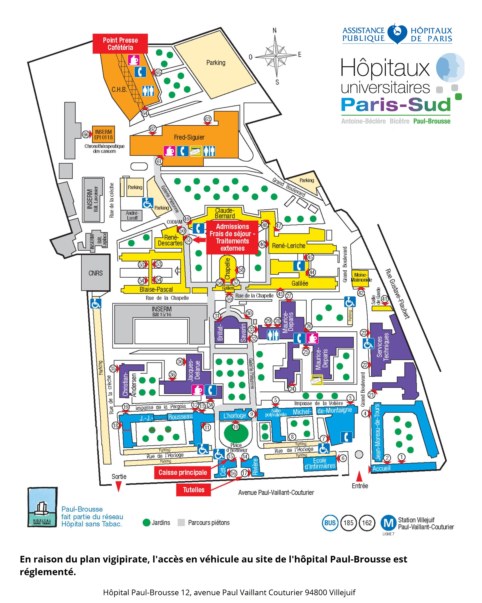

Institut Nationale de la Santé et de la Recherche Médicale qu'on l’appellera désormais Inserm.
Actuellement je suis dans le bâtiment 15-16 

 
 
 

 
L'équipe est fondée d’enseignant chercheur et de chercheur a temps plein.Pour devenir chercheur a temps plein ou enseignât chercheur il faut déjà avoir un doctorat puis passer un concours.La gestion de recrutement est confié a la structure d'accueil des candidats et les postes ouverts sont diffusés. Les constitue les dossier incluant un résumé succin de leur parcoure avec un projet de recherche détaillé et un descriptif des travaux effectuées en thèse ou en années post-doctorales. Un comité de sélection étudie les dossiers et sélectionnent une dizaine de candidats admissibles à une audition. Le comité de sélection auditionnent les candidats et établie un classement.  
 Les effectifs des différentes équipes de recherche du CESP sont composées d'hommes et de femmes de différentes nationalités. La majorité des chercheurs post-doctoraux sont de nationalités étrangères. La mobilité et le séjour post-doctoral à l'étranger est devenue un critère très important dans le recrutement d'un chercheur. 
 

 

 
le service d'enseignement est de 192 heures par années repartie sur l’année selon l'emploie du temps de la formation dans laquelle il enseigne. Certains enseignants peuvent avoir un service d’enseignement étales sur l’année alors que d'autre ont un service d'enseignement étale sur une courte période de l'année. L'enseignant chercheur passe aussi son temps a préparé des cours et participe à des réunions autours de projet de recherche à demandé ou déjà financé.

Le chercheur à plein temps peut devenir chargé de recherche puis directeur de recherche et l'enseignant-chercheur peut devenir maître de conférences puis professeur. 
